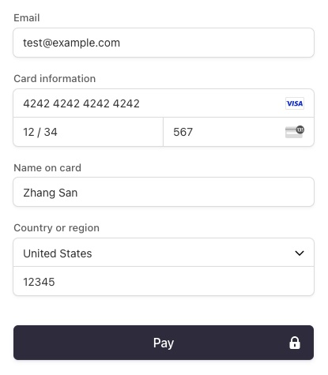
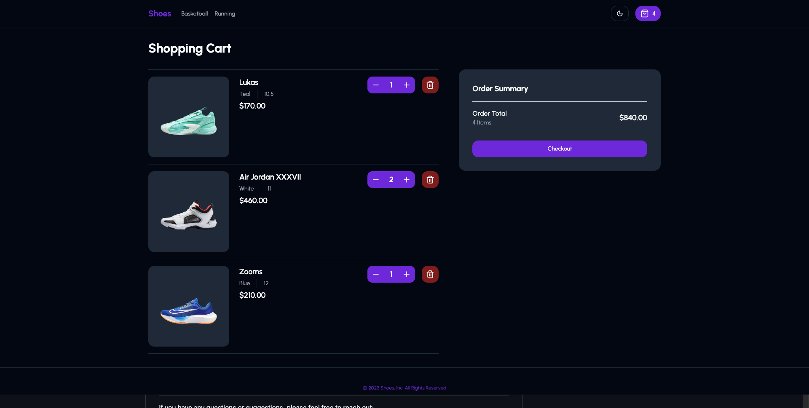
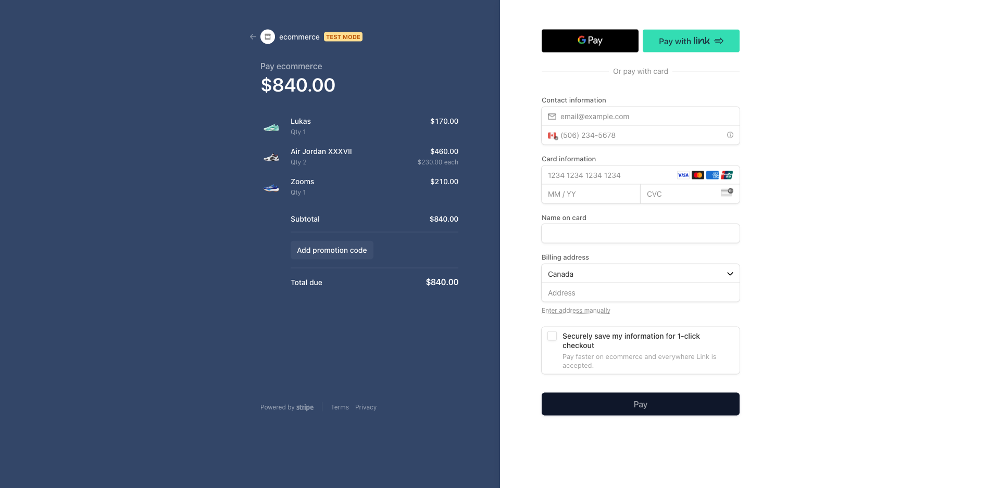
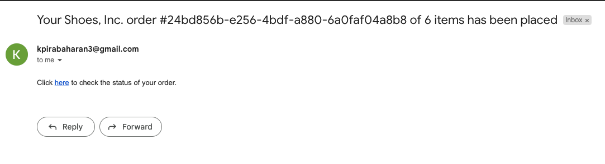
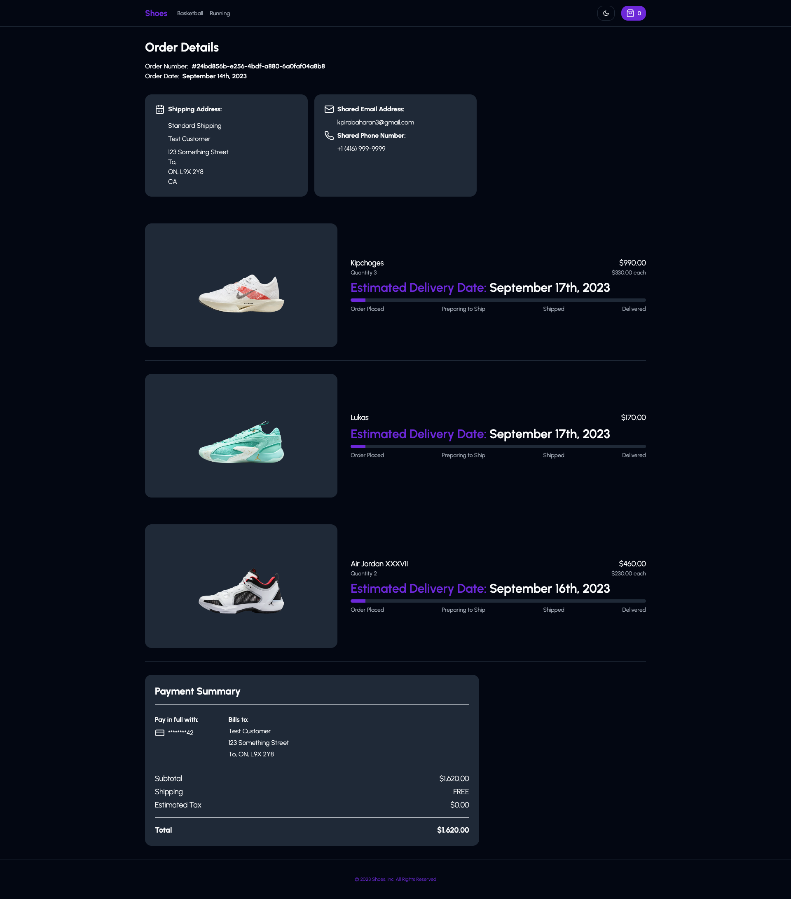

# E-commerce Store Website

Welcome to the E-commerce Store Website, the online shopping destination that pairs seamlessly with our E-commerce Admin Dashboard. Explore, browse, and purchase a wide range of products with ease. It is integrated with Stripe for secure payments, ensuring smooth transactions as you shop to your heart's content.

## Key Features

### Product Selection

- Browse and explore a diverse catalog of products across various categories.
- Discover trending items and new arrivals with ease.

### Effortless Shopping

- Add products to your cart and proceed to a hassle-free checkout process.
- Conveniently manage your orders and track their status.

### Secure Transactions

- Rest assured that your payments are processed securely with our integrated payment system.

### Theme Customization

- Personalize your shopping experience by choosing from 12 different store themes, including an eye-friendly dark mode option.

### Order Confirmation

- Receive instant order confirmation emails, providing you with all the details of your purchase for your records.

### Order Tracking

- Easily monitor the status and location of your orders directly on the website, so you always know where your items are.

## Demo

To showcase the multi-store feature, two stores have been established within the test account associated with the admin dashboard website. These stores include a clothing store and a shoe store, and this setup is designed to illustrate the platform's versatility by providing separate shopping experiences for distinct product categories.

**Click the links to explore the live websites:**

- [E-commerce Clothing Store Website](https://ecom-clothes.keeshigan.com/)
- [E-commerce Shoe Store Website](https://ecom-shoes.keeshigan.com/)

## Accompanied Admin Dashboard Website

### Github Page

**E-commerce Admin Dashboard GitHub:** [GitHub Repository](https://github.com/kpirabaharan/E-Commerce-Admin-Dashboard)

### Website

Explore the live admin dasboard website: [E-commerce Admin Dashboard Website](https://ecom-admin.keeshigan.com/)

## How to Shop

1. Visit the website and browse through our wide selection of products.
2. Click on a product to view details and pricing information.
3. Add products to your shopping cart.
4. Review your cart, make any necessary adjustments, and proceed to checkout.
5. Fill in the checkout form with test data (see below)

## Technologies

- Next.js: React framework for server-side rendering and building web applications
- Shadcn UI: A popular component library for building accessible and highly customizable user interfaces
- Tailwind CSS: Utility-first CSS framework for styling
- Stripe: Payment processing platform for handling recurring payments

## Screenshots

### Home Page

### Category Page

### Checkout Page

### Stripe Payment Page

### Order Email

### Order Page

## License

This project is licensed under the [MIT License](https://opensource.org/licenses/MIT).

## Contact

If you have any questions or suggestions, please feel free to reach out:

- Email: kpirabaharan3@gmail.com
- LinkedIn: [https://linkedin.com/in/kpirabaharan/](https://linkedin.com/in/kpirabaharan/)
